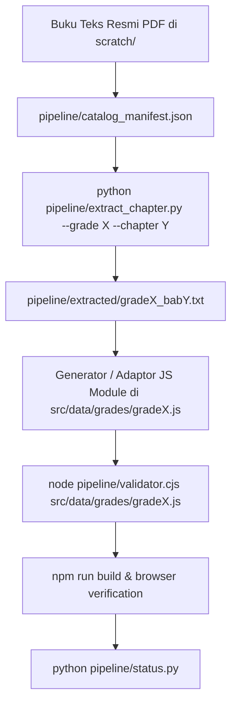

# Curriculum Alignment Pipeline

Pipeline terstruktur untuk melakukan ekstraksi, pemodelan, dan penyelarasan materi matematika dari buku teks resmi ke dalam platform web **AwesomeMathJ**.

---

## 1. Arsitektur Pipeline



---

## 2. Komponen Pipeline

1. **Manifest Kurikulum Tunggal (`pipeline/catalog_manifest.json`)**
   * Menyimpan metadata resmi seluruh kelas (Kelas 4 SD s.d. 12 SMA).
   * Mendefinisikan nomor bab, ID modul, judul resmi, rentang halaman buku, dan file PDF sumber.

2. **Ekstraktor Teks Bab Otomatis (`pipeline/extract_chapter.py`)**
   * Mengekstrak isi bab secara presisi langsung dari PDF ke format teks di `pipeline/extracted/`.
   * Perintah:
     ```bash
     python pipeline/extract_chapter.py --grade 5 --chapter 1
     ```

3. **Validator Integritas & Kualitas (`pipeline/validator.cjs`)**
   * Memastikan setiap bab memiliki 6 pilar pedagogis: `overview`, `coreConcepts`, `workedExamples`, `keyFormulas`, `misconceptions`, `tutorTip`.
   * Memastikan setiap opsi soal memiliki 4 pilihan (A, B, C, D) dengan kunci jawaban yang valid.
   * Menegakkan aturan sanitasi:
     * ❌ Tidak ada nama personal (*Sir Jevon*) di portal publik.
     * ❌ Tidak ada nama institusi pemerintah (*Kemendikdasmen*, *Kemendikbud*, *SIBI*).
     * ❌ Tidak ada tag gimik ujian (`[UH]`, `[PAS]`, `[HOTS]`).
   * Perintah:
     ```bash
     node pipeline/validator.cjs src/data/grades/grade5.js
     ```

4. **Monitor Status Pipeline Real-Time (`pipeline/status.py`)**
   * Menampilkan ringkasan status setiap kelas: target bab, bab aktif, jumlah soal, ketersediaan PDF, dan status penyelarasan.
   * Perintah:
     ```bash
     python pipeline/status.py
     ```

---

## 3. Langkah Kerja Bertahap (Step-by-Step)
Untuk setiap kelas berikutnya:
1. Jalankan `python pipeline/extract_chapter.py --grade X --chapter Y` untuk bab yang akan digarap.
2. Tulis data modul terstruktur ke `src/data/grades/gradeX.js` mengadaptasi konteks nyata dan soal dari buku teks.
3. Jalankan `node pipeline/validator.cjs src/data/grades/gradeX.js`.
4. Jalankan `npm run build` untuk memvalidasi bundle Vite.
5. Jalankan `python pipeline/status.py` untuk memeriksa progres keseluruhan.
